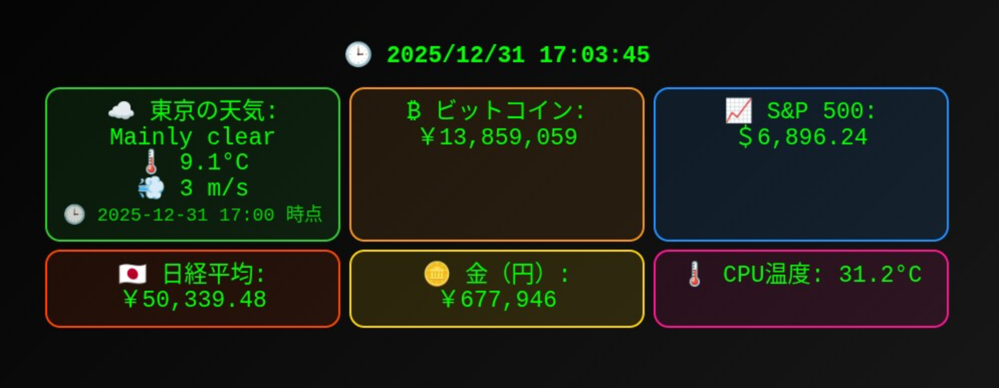

# Kiosk

A simple trading dashboard powered by FastAPI. It shows BTC, stock indices, gold prices, weather, and CPU temperature.



## Requirements
- Python 3.12+
- uv (recommended)

## Setup
```bash
uv sync
```

## Frontend build
```bash
cd frontend
npm install
npm run build
```

## Run
```bash
uv run uvicorn main:app --host 0.0.0.0 --port 8080
```

Open `http://localhost:8080` in your browser.

## API
- `GET /api/dashboard`: BTC/indices/gold/temperature/time
- `GET /api/weather`: Current weather in Tokyo

## Notes
Because this depends on external APIs, values may temporarily become `N/A` due to network issues or provider status.
The Svelte UI is served from `frontend/dist` when built; otherwise the legacy inline HTML is used.
